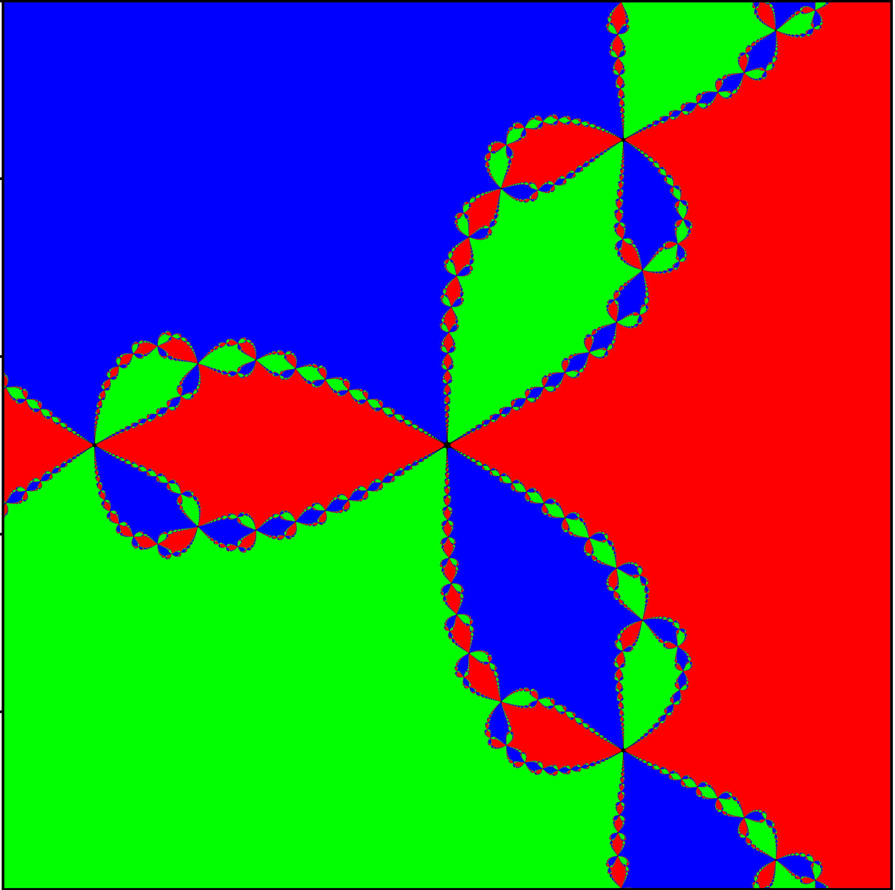

# Newton Fractal Visualizer

## About
This project visualizes the basins of attraction for the Newton-Raphson method applied to complex polynomials. By iterating the Newton update rule across a grid of points in the complex plane, the code generates Newton fractals—intricate, self-similar patterns where colors represent which root the algorithm converges to. It is a visual demonstration of how chaotic the boundaries between convergence zones can be, even for simple functions like $z^3 - 1$.

## Technical Details
The implementation focuses on the Newton-Raphson iterative formula for finding roots of a function $f(z)$:

$$z_{n+1} = z_n - \frac{f(z_n)}{f'(z_n)}$$

The project includes implementations for two specific cases:
- $f(z) = z^2 - 1$: Results in two distinct basins of attraction.
- $f(z) = z^3 - 1$: Results in three symmetric basins of attraction.

The code uses `numpy` for grid generation and `matplotlib` for plotting the final results. In the $z^3 - 1$ implementation, the project avoids Python's built-in complex types in favor of manual complex multiplication and power functions to handle the arithmetic. The visualization is achieved by mapping each point $(x, y)$ in the complex plane to a color based on its proximity to one of the roots after a set number of iterations.

## Execution
The project is provided as a series of Jupyter Notebooks. To run the visualizations:

1. Ensure you have the following dependencies installed:
   - `numpy`
   - `matplotlib`
   - `tqdm`
2. Open the notebooks (`z^2-1.ipynb` or `z^3-1.ipynb`) using Jupyter Lab, Jupyter Notebook, or VS Code.
3. Run the cells sequentially. Note that higher resolution grids (e.g., $N=1000$) will take longer to render due to the nature of the point-by-point plotting method used in the notebooks.